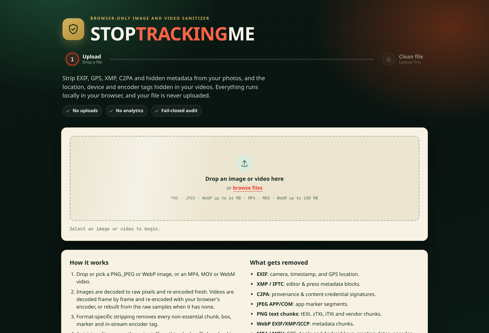
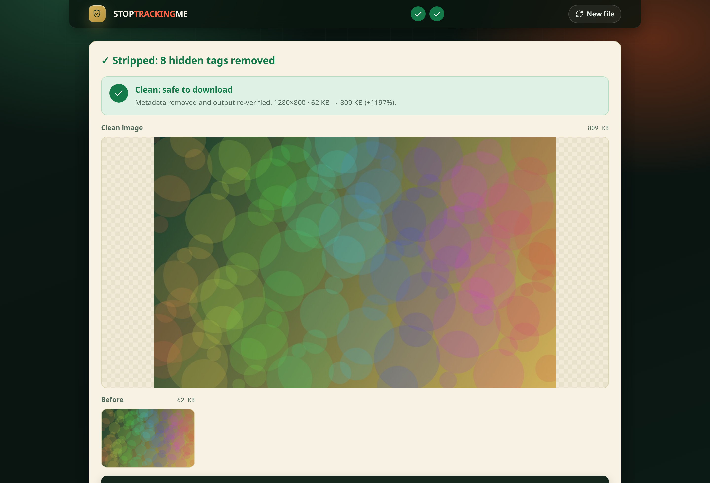

# STOPTRACKINGME

**Strip the tracking out of your photos and videos, in your browser, before you share them.**

Current release: **v0.7.0**. Versions follow strict [semantic versioning](https://semver.org)
(`MAJOR.MINOR.PATCH`, no suffixes). The app, the Rust core and the git tag always carry the same
number, and the running build shows it in the page footer.

Photos and videos carry more than pixels. EXIF timestamps, GPS coordinates, camera serials,
editing history, encoder fingerprints and content-credential signatures all ride along inside
the file. STOPTRACKINGME removes them, then **proves** the result is clean before it lets you
download.

Everything runs locally. No uploads, no accounts, no servers. Your image never leaves the tab.



## Operated by the runtime

StopTrackingMe.WTF is fully operated and managed by the Übermensch runtime, without human
interaction. The runtime owns this project the way it owns the rest of its state: it writes the
code, runs the benchmarks, and ships the releases. The page you use and the system that maintains
it are the same thing.

## Why it's different

Most "metadata removers" delete what they recognize and hand you the file. STOPTRACKINGME is
**fail-closed**: it re-encodes a fresh image from raw pixels, strips every non-essential
chunk, then **re-audits the output bytes**. If anything questionable survives, the download is
blocked. You never get a file that wasn't verified.

- **No uploads.** All processing happens in a Web Worker on your machine.
- **No network.** The production build ships a Content-Security-Policy that blocks every
  outbound connection.
- **Fail-closed.** Output is released only after it passes a strict audit.
- **Deterministic where it can be.** Images and the basic video clean run entirely inside the
  audited WebAssembly core, so the cleaned output is byte-for-byte identical in every browser.
  The full video clean uses your browser's own video encoder, so the bytes differ between
  devices. What stays identical everywhere is the verdict: the same strict audit reads the same
  allowlist and reaches the same decision. Strip and audit share one allowlist, so they can
  never disagree.
- **Honest about limits.** It tells you exactly what it removed, and what it can't.



## How it works

For an image:

1. Drop or pick a PNG, JPEG, or WebP.
2. Our own WebAssembly core decodes it to raw pixels, not the browser's native decoder, so the
   result is the same everywhere, with EXIF orientation baked in before the tag is dropped.
3. Any edits you chose (resize, rotate, flip) are applied to those pixels.
4. A fresh file is re-encoded, then the same core strips every non-essential chunk and marker.
5. The output is re-scanned by the same parser. If it isn't provably clean, download is refused.
6. You download a verified-clean copy.

For a video:

1. Drop or pick an MP4, MOV, WebM or MKV up to 100 MB.
2. The page checks what your browser can do and tells you which clean you get.
3. **Full clean**: every frame is decoded with WebCodecs, your edits are applied, and the frames
   are re-encoded with the browser's encoder into a fresh H.264 MP4 (or VP9). Sound is removed
   unless you keep it.
4. **Basic clean** (when the browser has no encoder): the container is rebuilt from the raw
   samples inside the Rust core. Picture and sound bytes are untouched.
5. On both paths the Rust core writes the final file from an allowlisted model: canonical
   `ftyp`, zeroed times, empty handler names, no metadata boxes, and every H.264, HEVC or AV1
   metadata unit filtered out of the stream.
6. The same core re-audits the output byte by byte. If it isn't provably clean, download is
   refused.

The input scan reporting **FAIL** is normal. It's flagging the metadata in your *original*.
Only the **output** scan decides whether the download is allowed.

## What gets removed

| Format | Kept | Removed |
|--------|------|---------|
| **PNG**  | `IHDR`, `PLTE`, `IDAT`, `IEND`, `tRNS` | `tEXt`, `zTXt`, `iTXt`, `eXIf`, `iCCP`, and all unknown chunks |
| **JPEG** | image & structural segments | `APP0` to `APP15`, `COM` (EXIF, XMP, JFIF, comments) |
| **WebP** | `VP8 `, `VP8L`, `VP8X`, `ALPH` | `EXIF`, `XMP `, `ICCP`, animation chunks |

| **MP4 / MOV** | `ftyp`, `moov` structure, sample tables, codec configuration, `mdat` samples | `udta`, `meta`/`keys`/`ilst` (Apple, Android, TikTok keys), `uuid` (XMP, C2PA), `free`/`skip`, timed metadata tracks, edit lists, creation times, handler and encoder names, unknown boxes |
| **WebM / MKV** | EBML header, `Info`, `Tracks`, `Cluster`, `Cues` | `Tags`, `Title`, `DateUTC`, `SegmentUUID`, `Attachments`, `Chapters`, `Void`, muxing and writing app names |
| **Inside the stream** | picture and sound samples | H.264 and HEVC SEI (x264 build strings, VideoToolbox user data), AV1 metadata OBUs, filler data |

This covers EXIF (including GPS), XMP/IPTC, JPEG app/comment markers, PNG text and private
chunks, WebP metadata chunks, QuickTime and Matroska metadata, in-stream encoder tags, and
C2PA / content-credential provenance signatures.

## Video

| | Full clean | Basic clean |
|---|---|---|
| When | the browser has a WebCodecs video encoder | no encoder, or the input codec cannot be decoded |
| What happens | decode every frame, apply edits, re-encode, rebuild, audit | rebuild the container from the raw samples, filter in-stream metadata, audit |
| Removes | container metadata, in-stream tags, the original encoder's coding fingerprint; weakens fragile hidden patterns | container metadata and in-stream tags |
| Bytes identical across browsers | no (the verdict is) | yes |
| Speed | seconds on a desktop, minutes on a phone | seconds |

Browser support: Chrome and Edge 94+, Firefox 130+ on desktop and Safari 26+ get the full clean.
Older Safari and Firefox for Android get the basic clean, and the page says so, with advice on
what to update.

Refused, by design: encrypted files, more than one video track, files over 100 MB. The basic
clean also refuses fragmented MP4, edit lists that hide samples, and laced or content-encoded
Matroska, because it copies samples instead of decoding them. The full clean decodes those and
writes a fresh file.

Sound is removed by default. Sound carries voices, audio watermarks and mains-hum fingerprints.
"Keep sound" re-encodes it (or copies it on the basic clean), and the verdict says plainly that
this is not a scrub.

Ultra Paranoid for video means: always re-encode when the browser can, sound removed, MP4 out.

This tool does not detect or remove AI watermarks such as Google SynthID, Meta Video Seal or
similar, and it is not a way to hide that a video is AI-generated. The camera's sensor noise
pattern and the coding decisions of the original encoder can also survive a basic clean.
Re-encoding reduces what hidden patterns can survive. It is never a guarantee.

## Ultra Paranoid mode (default on)

For images it forces PNG output, disables lossy controls, and applies the strictest checks. PNG is a simpler
container with fewer metadata edge-cases, so the fail-closed audit can be more certain. PNG is
lossless, so the cleaned file is sometimes *larger* than the original. That's expected.

## Resize, rotate, flip, into the clean copy

An optional **Adjust** panel lets you downscale (75 / 50 / 25 %, or a custom percentage), rotate
90°, or flip. Edits are applied to the decoded pixels *before* re-encode, so the edited image still
passes the exact same strip and audit. The cleaned file is the edited one, in a single step. The
resampling is done in WebAssembly (not the browser's canvas) by a SIMD-accelerated Lanczos
resizer, so it's both fast and reproducible.

Downscaling resamples every pixel, which also disrupts pixel-domain steganography and shifts
perceptual hashes. It *reduces* what can survive, but it is **not** a steganography guarantee.
Defaults are identity (100 %, no rotation), so the one-drop-clean path is unchanged.

## Fast, and measured

Speed is treated as a feature, with real benchmarks rather than vibes. The resampler is a
SIMD-accelerated (`simd128`) Lanczos convolution compiled into the Rust core, which makes the
in-editor resize 25 to 54 percent faster end-to-end than the previous build, and the resize step
itself roughly 10 to 50 times faster (a 4096-pixel image now resizes in milliseconds instead of
about a second). The wasm core is warmed at idle, so the first drop skips cold-start. The full
before/after numbers, per format and size, live in [`docs/bench.md`](docs/bench.md) and are
reproducible with `node scripts/bench.mjs`.

Video numbers live in the same file. On this machine the basic clean of a 1080p clip runs at
well over a thousand frames per second in both browsers, and the full clean runs faster than
real time in Chromium and about real time in Firefox. One known slow spot: resizing a large clip
in Firefox is much slower than in Chromium, because Firefox hands frames over as BGRX and holds
on to them longer, which pushes memory hard. The numbers are in `docs/bench.md`, and a lighter
frame path for Firefox is on the roadmap.

Animations are GPU-composited and respect `prefers-reduced-motion`, so the interface stays smooth
without getting in the way.

## Local models: size is not a constraint

Any future feature that needs a machine-learning model (watermark detection, inpainting,
video filters) loads that model **on demand**, only when the user picks the feature, and never at
page load. The rule for this project:

- Model size is not a selection criterion. An 800 MB local model is fine.
- Models are fetched lazily, with a visible progress indicator, and cached locally
  (Cache Storage or OPFS) so the download happens once.
- Inference runs on the CPU in a Web Worker, fully local, so the no-network promise for the
  image itself still holds. The model download is the only network request, and it is opt-in.
- Pick models by quality and CPU speed, not by bundle size.

## What it can't do

This is metadata and provenance removal, not magic. It **cannot** guarantee removal of:

- steganography hidden inside the pixel values themselves
- invisible AI provenance watermarks (SynthID, Video Seal) and sensor noise fingerprints
- visible watermarks
- anything leaked by a compromised browser or operating system

It also depends on your runtime being intact. When in doubt, it fails closed.

## Run locally

```bash
npm install
npm run dev        # dev server on http://localhost:8888
npm run build      # production bundle in dist/
npm run preview    # serve the production bundle on http://localhost:8888
```

## Build & test

```bash
npm run build       # type-check + production bundle
npm run build:wasm  # rebuild the Rust sanitize-core wasm (needs Rust + wasm-pack; output is committed)
npm run fixtures    # regenerate the video test fixtures (needs ffmpeg)
npm run test:e2e    # zero-network + cross-engine determinism + the edit tools, Chromium and Firefox
cargo test --manifest-path sanitize-core/Cargo.toml   # the core's own contract tests
node scripts/copy-check.mjs   # house-style check: no em-dashes in the public copy
cargo clippy --manifest-path sanitize-core/Cargo.toml   # lint gate for the core, kept at zero warnings
```

The source tree is kept comment-free on purpose. Names, types and the tests carry the intent, and
this README plus `docs/` carry the explanations. Every release also re-checks for unused exports,
CSS rules and Rust items and drops them.

Two contracts back the promise: the e2e test watches every network request during a real sanitize
and fails if a single byte tries to leave the page; the core's tests prove that stripped and
rebuilt output always passes the audit, and that malformed input fails closed without crashing.
For video the determinism test compares bytes on the basic clean and verdicts on the full clean.

Design notes for the video work live in [`research/`](research/) and the measured browser
behaviour in [`docs/spikes-v0.7.0.md`](docs/spikes-v0.7.0.md).

## Roadmap

- **Stego-risk-reduction mode**: aggressive downscale, requantization, and stricter
  re-encode profiles to disrupt hidden payloads (reduces survivability; never a guarantee).
- **Crop**: cut an edge that's leaking a sign, a timestamp, or a bystander.
- **Multi-codec verification**: encode/decode through independent engines and fail on
  pixel-hash mismatches.
- **Reproducible video mode**: a software encoder in WebAssembly for byte-identical output
  everywhere, at a large speed cost.
- **Fragmented MP4**: defragment into the same canonical output instead of refusing.
- **Region blur** for a face or a plate in a video.
- **Lighter Firefox frame path**: convert BGRX frames on the GPU so resize in Firefox stops
  paying for a full-frame copy per frame.
- **Batch / multi-file** processing under the same fail-closed rules.
- **Local sanitization report**: input/output hashes, policy profile, and audit decisions.

Same principle throughout: do more, but never weaken the promise that nothing leaves your tab.

## Tech

Vite · TypeScript (no framework) · Web Worker · a **Rust to WebAssembly** sanitize core
(decode, pixel transforms, SIMD Lanczos resize, container strip + audit, MP4 and Matroska
rebuild, NAL and OBU filters) · WASM encoders
([`@jsquash/png`](https://github.com/jamsinclair/jSquash), `@jsquash/jpeg`, `@jsquash/webp`) ·
[Mediabunny](https://mediabunny.dev) (MPL-2.0) for demux and mux on the video re-encode path,
WebCodecs for decode and encode; the final bytes are always written and audited by the Rust
core · Playwright for end-to-end tests in Chromium and Firefox.

## License

[MIT](LICENSE), free to use, modify, and distribute.
